# 2D 老师与对话系统流程图代码

本文档提供 2D 老师系统与对话系统的 Mermaid 流程图代码，可直接复制到：

- Mermaid Live Editor
- Typora
- 飞书 Markdown
- 任意支持 Mermaid 的文档工具

---

## 1. 统一系统总体架构图

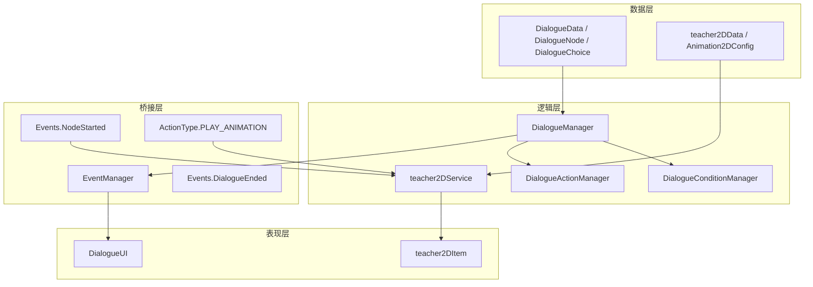

---

## 2. 对话数据结构图

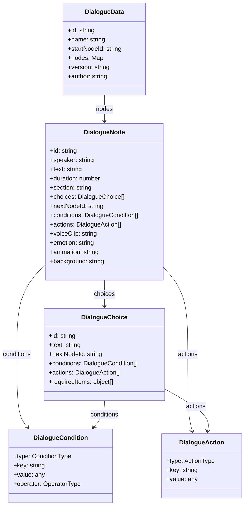

---

## 3. 对话加载与“节点注册”流程

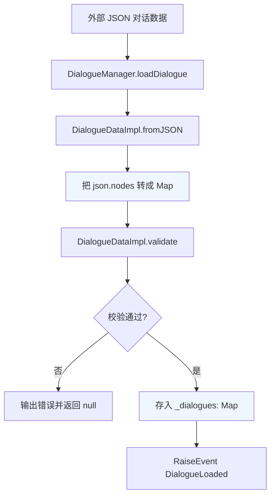

### 说明

这里的“注册节点”本质上不是注册节点类型，而是：

- 把整段对话资源注册进 `DialogueManager`
- 节点作为 `Map<string, DialogueNode>` 中的条目存在

---

## 4. 对话启动与节点推进流程

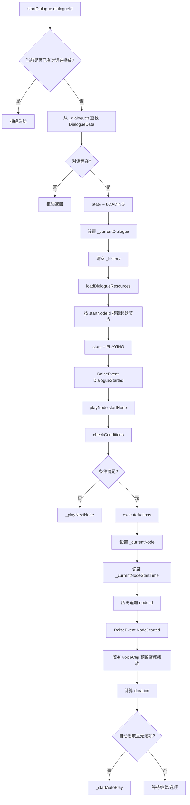

---

## 5. 对话分支与选项逻辑

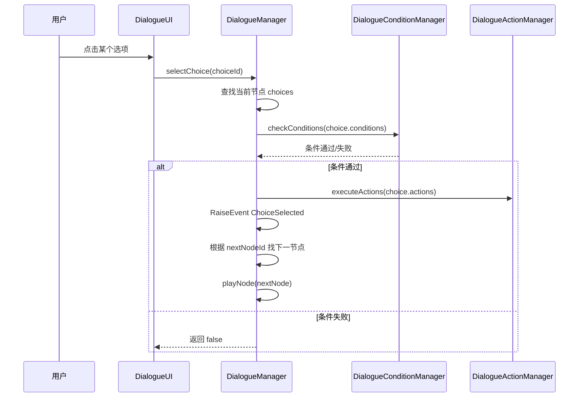

---

## 6. 对话 UI 响应流程

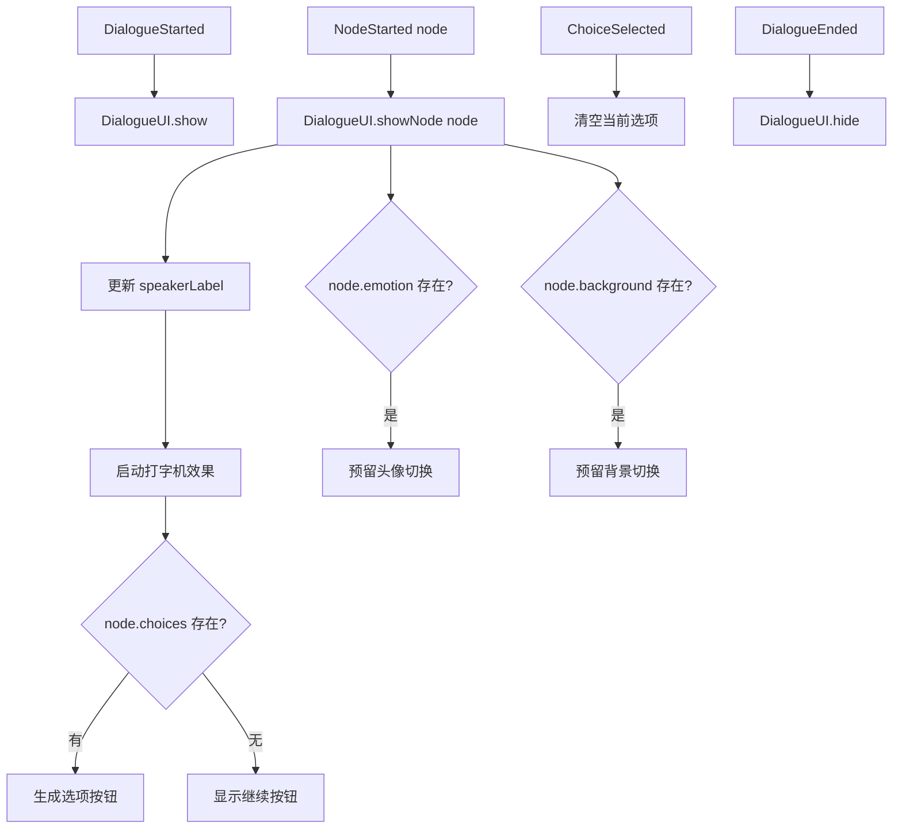

---

## 7. 2D 老师系统结构图

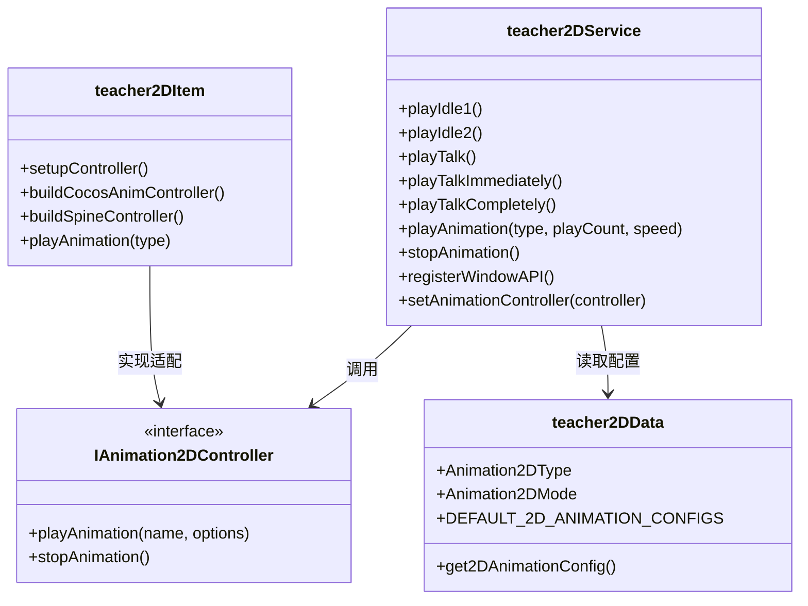

---

## 8. 2D 老师播放链路

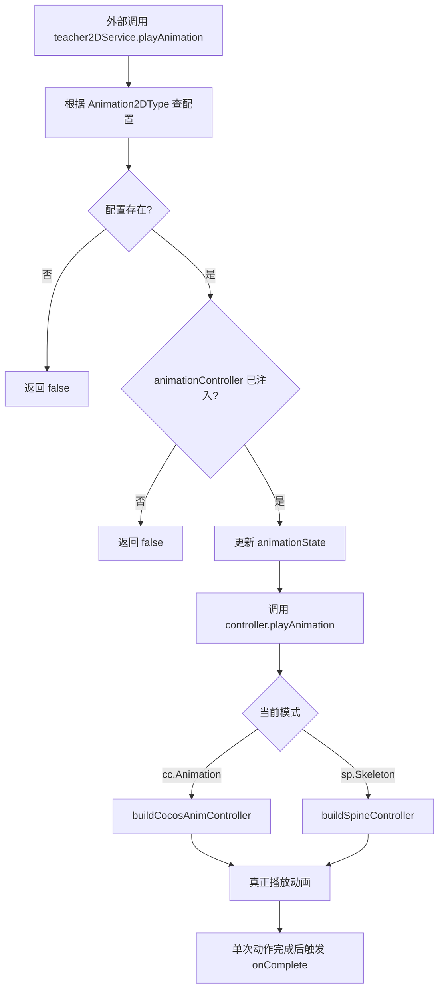

---

## 9. 对话参数驱动 2D 老师的推荐联动方案

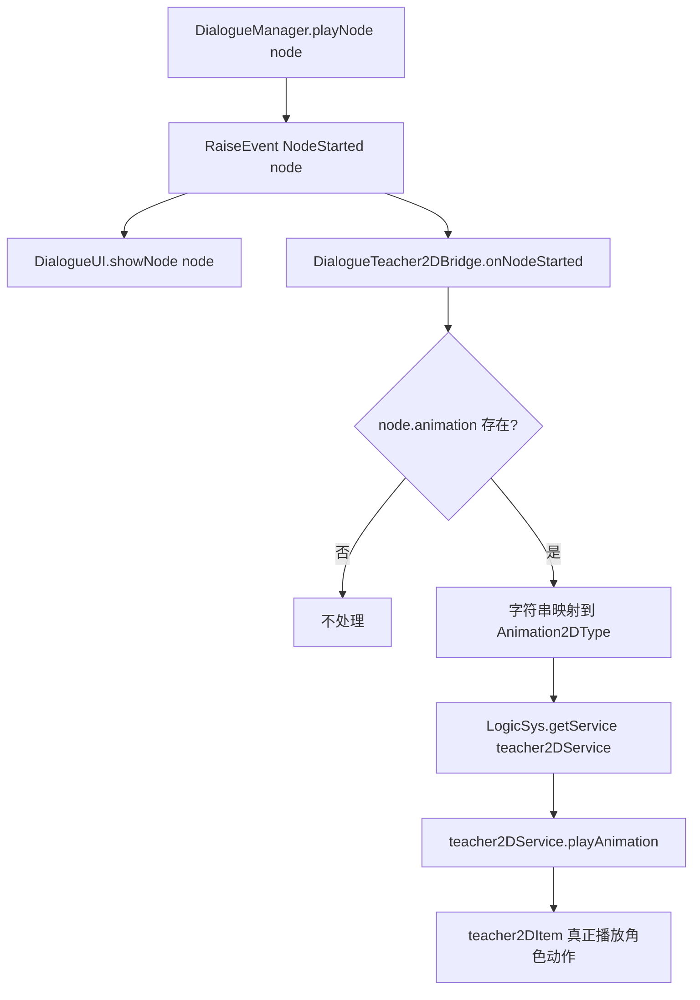

---

## 10. 基于动作系统驱动 2D 老师的方案

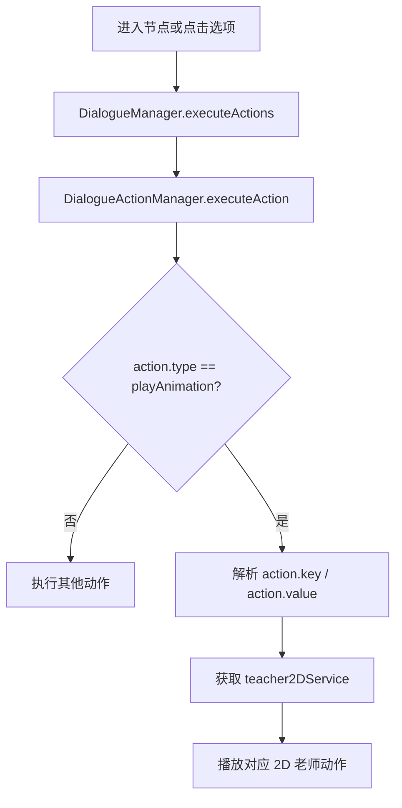

---

## 11. 推荐最终形态：节点字段 + 动作字段并存

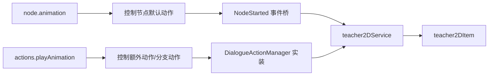

---

## 12. 统一系统的完整时序图

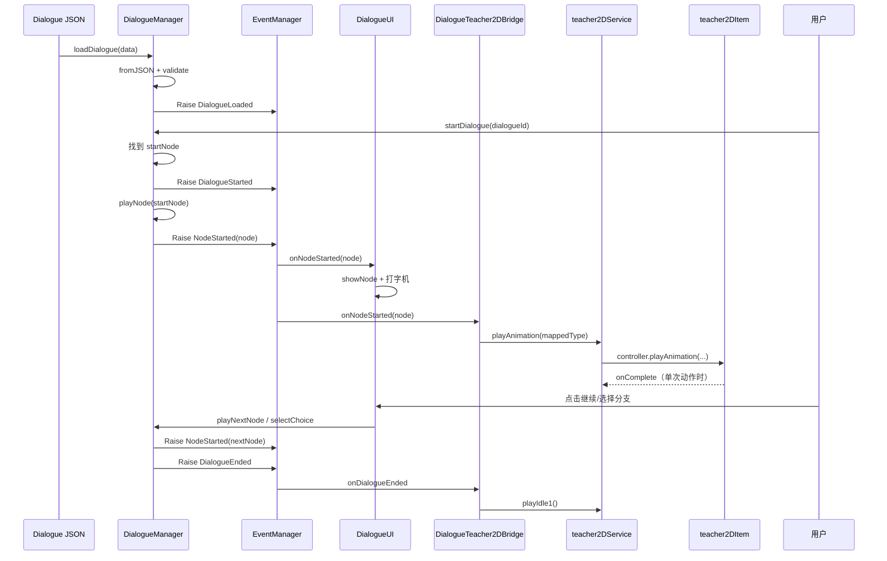

