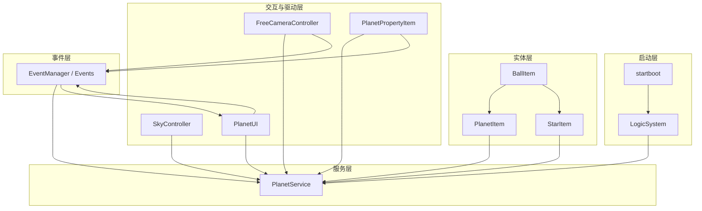
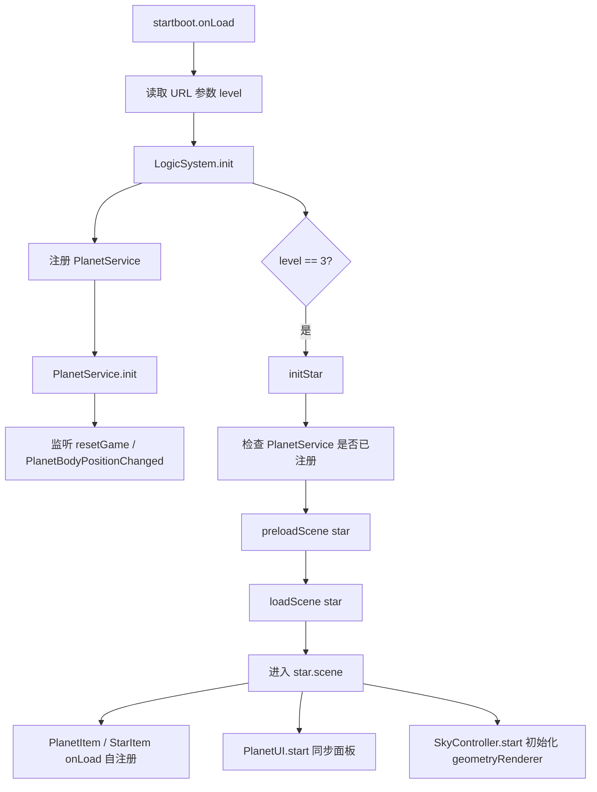
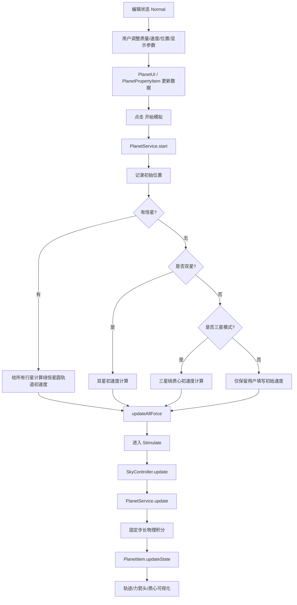
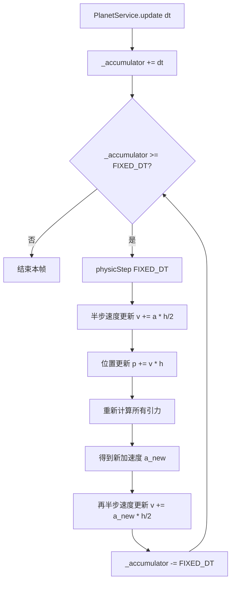
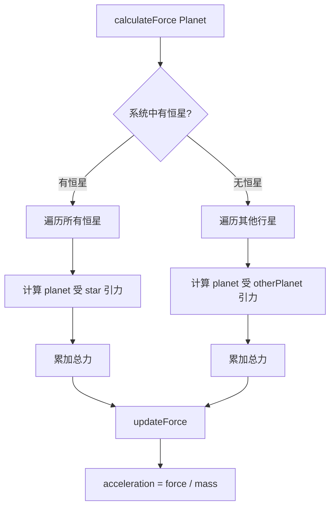
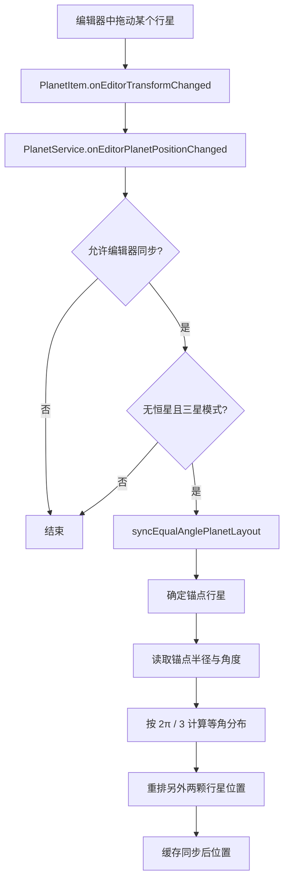
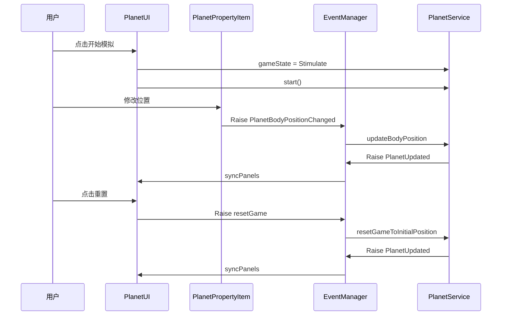
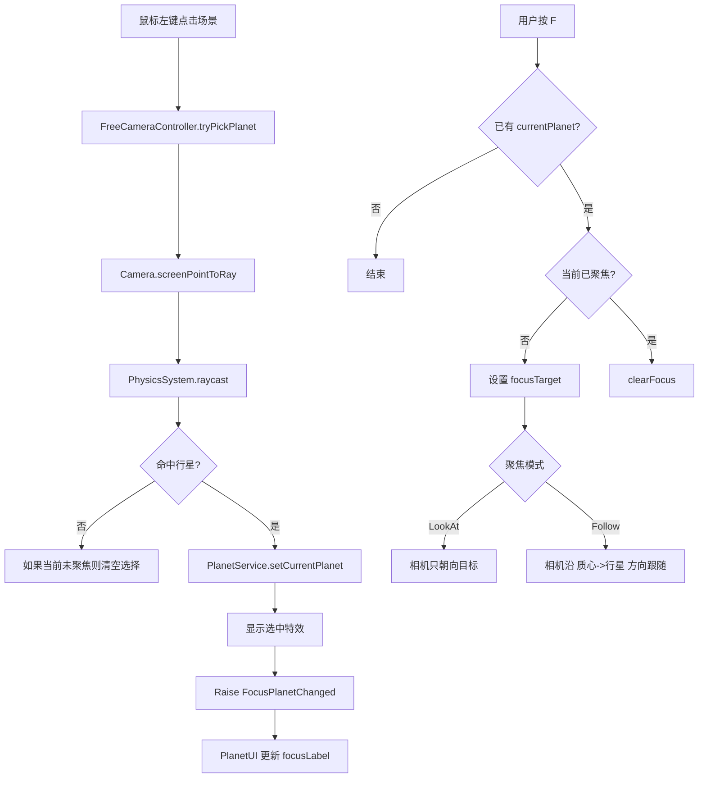
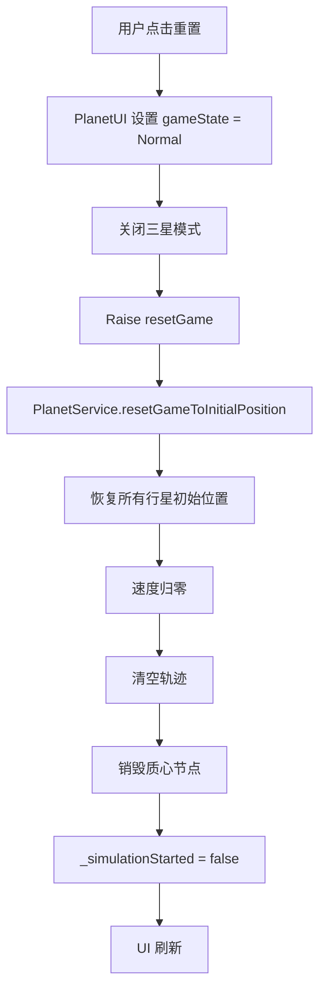
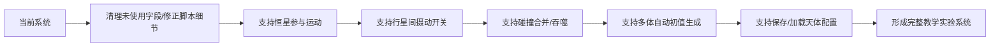

# 行星系统流程图代码

本文档提供行星系统对应的 Mermaid 流程图代码，可直接复制到：

- Mermaid Live Editor
- Typora
- 飞书文档（支持 Mermaid 时）
- Markdown 渲染器

---

## 1. 系统总体架构图

---

## 2. 启动初始化流程

---

## 3. 行星系统运行流程

---

## 4. 固定步长与 Verlet 物理更新流程

---

## 5. 引力计算分支图

---

## 6. 三星等角布局同步流程

---

## 7. UI 与事件交互流程

---

## 8. 相机选择与聚焦流程

---

## 9. 重置流程

---

## 10. 推荐补充：后续扩展流程图

